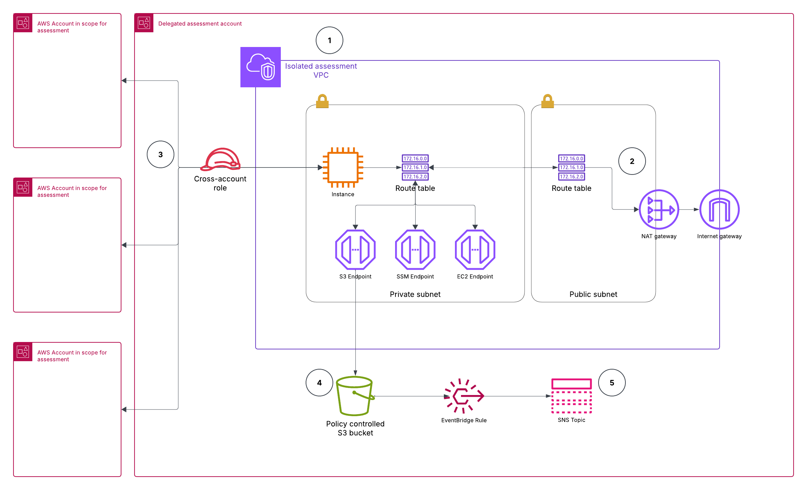

# Softcat AWS Security and Health Assessment

This should give you everything you need to create and run resources to support an AWS SHA where Terraform is the preferred creation method. The templates here create everything necessary to build and run the assessment, and provide information to the customer so they know what's happening ahead of time.

This process originated from [AWS Prescriptive Guidance](https://docs.aws.amazon.com/prescriptive-guidance/latest/patterns/create-a-consolidated-report-of-prowler-security-findings-from-multiple-aws-accounts.html) and has been translated from CloudFormation to Terraform. It has been tested and works well, but please contact Jason McLeod if any issues are found.

Prowler course code can be found [here](https://github.com/prowler-cloud/prowler)



## Prerequisites
You need sufficient access to the Client's AWS Organization, inlcuding member accounts in scope, to deploy the resources as needed. Alternatively, send the files to the Client to apend to their own Terraform code and run it to create the resources.

You also need access to connect to the EC2 instance via SSM.

## Deployment
Edit the Variables in variables.tf to meet your needs. Most can be left as-is, but you'll need to set the followiing at minimum:
- instance_type
- notification_recipient
- account_list

Most resources deploy to the delegated security account, but each account in scope for the assessment will also need the SHAExecRole IAM role and attached policies. This allows the script to reach all relevant accounts and gather data to build the report.

While the resources are deploying, remember to confirm the SNS Topic subscription when you receive the emai.

## Usage
Once the resources are deployed, connect to the EC2 instance via SSM and check the the script config:

```
sudo -i
screen
cd /usr/local/prowler
nano ./prowler_scan.sh
```

the script config should match the variables you set in Terraform. If not, you can change them here and save the file before continuing.

Run the script:
```
./prowler_scan.sh
```
Check for errors and then leave to do its thing. Once it's finished, you should receive an email. then you can head to the S3 bucket and download the zip file.

After you've verified the output is complete, empty the bucket and stop the EC2 instance.

## Process the findings
1. Unzip the output you downloaded.

2. Make a copy of [prowler-report-template.xlsx](docs/prowler-report-template.xlsx) and delete all contents of the Prowler CSV sheet, including the headers.

3. Open the prowler-fullorgresults-accessdeniedfiltered.txt in Excel, select Column A and copy.

4. Paste it into Cell A1 of the Prowler CSV sheet.

5. Convert text to columns using Semicolon delimiter.

6. Go to the Findings worksheet

7. Choose PivotTable Tools on the ribbon, Analyze and Refresh All.

8. Clear all severity filters to show all findings, then set column A to Number format with 0 decimal places.

9. Save the workbook.

You can now use the formatted output to build a full findings Report for the client, and when finished, the workbook can be included in the deliverables as additional supporting data to your completed report.

